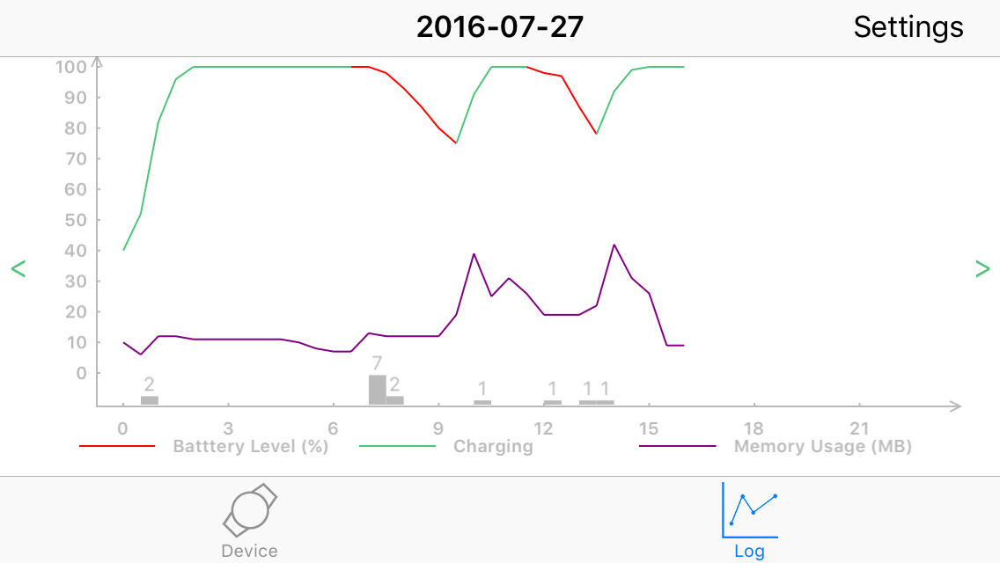
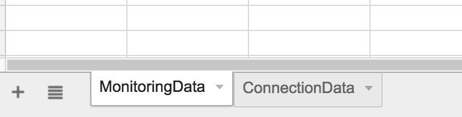

# HDPhoneMonitor

HDPhoneMonitor is a service allow you to monitor your phone battery level and app memory usage.



## Installation
This isn't on CocoaPods yet, so to install, add this to your Podfile
```
pod 'HDPhoneMonitor', :git => 'https://github.com/dqhieu/HDPhoneMonitor.git'
```

## Usage
### Initialize
1. Import the `HDPhoneMonitor` module:
  ```swift
  import HDPhoneMonitor
  ```

2. Start a `HDPhoneMonitor` service, typically in your application's `application:didFinishLaunchingWithOptions: method:`
  ```swift
  func application(application: UIApplication, didFinishLaunchingWithOptions launchOptions: [NSObject: AnyObject]?) -> Bool {
    // Override point for customization after application launch.
    HDPhoneMonitor.startService()
    return true
  }
  ```
3. Enable cloud storage service if you want to save your data on Google Spreadsheet. You must need to enable Google Spreadsheet API service first, follow this [instruction](https://developers.google.com/sheets/quickstart/ios?ver=swift)

  ```swift
  let keyChainName = "{YOUR_KEY_CHAIN_NAME}"
  let clientID = "{YOUR_CLIEN_ID}"
  let spreadSheetID = "{YOUR_SPREADSHEET_ID}"

  func application(application: UIApplication, didFinishLaunchingWithOptions launchOptions: [NSObject: AnyObject]?) -> Bool {
    // Override point for customization after application launch.
    HDPhoneMonitor.startService()
    HDPhoneMonitor.enableCloudStorage(keyChainName, clientID, spreadSheetID)
    return true
  }
  ```

  Your spreadsheet must have 2 sheets named "MonitoringData" and "ConnectionData", like this:
  

### Using
Put `HDPhoneMonitor.sharedService.monitor()` in the functions that run every 5 mins or less in both background mode and foreground mode. That mean the service will log your phone battery level and memory usage every 5 mins. You can change the time interval in `HDPhoneMonitor.swift`

  For example:

  ```swift
  func locationManager(manager: CLLocationManager, didUpdateLocations locations: [CLLocation]) {
      HDPhoneMonitor.sharedService.monitor()
      // Your code goes here
      ...
  }
  ```
  For periperal devices:
  ```swift
  // This function runs every 8 seconds when you set notification for `heartBeatCommandReceiverCharacteristic` and send it a command
  func peripheral(peripheral: CBPeripheral, didUpdateNotificationStateForCharacteristic characteristic: CBCharacteristic, error: NSError?) {
      if characteristic.UUID.isEqual(CBUUID(string: BLECharacteristic.HeartBeatSender.rawValue)) {
        HDPhoneMonitor.sharedService.monitor()
        // Your code goes here
        ...
      }
  }
  ```
  ```swift
  func centralManager(central: CBCentralManager, didConnectPeripheral peripheral: CBPeripheral) {
    HDPhoneMonitor.sharedService.deviceDidConnect(getIdFromDevice(peripheral))
    // Your code goes here
    ...
  }
  ```
  ```swift
  func centralManager(central: CBCentralManager, didDisconnectPeripheral peripheral: CBPeripheral, error: NSError?) {
    HDPhoneMonitor.sharedService.deviceConnectionDidDrop(getIdFromDevice(peripheral))
    // Your code goes here
    ...
  }
  ```
  ...

### Display

Create a `UIViewController` and set it custom class `HDPhoneMonitorChartViewController`


or create by programmatically
```swift
let phoneMonitorChartViewController = HDPhoneMonitorChartViewController()
self.navigationController!.pushViewController(phoneMonitorChartViewController, animated: true)
```

## Requirement

  - [Realm.io](https://realm.io/): We use RealmSwift to save the data and display them into chart. So you need install `pod 'RealmSwift'` if you want to use our service.
  - Libraries for Google Sheet API:
    - Google API Client `pod 'GoogleAPIClient/Core', '~> 1.0.2'`
    - Google OAuth2 `pod 'GTMOAuth2', '~> 1.1.0'`
  - `pod 'SVProgressHUD'` for UI

## License
HDPhoneMonitor is released under the MIT license. See LICENSE for details.

## SpecialThanks

- [kevinzhow](https://github.com/kevinzhow) for his awesome [PNChart](https://github.com/kevinzhow/PNChart). I did some customizations for better displaying.
